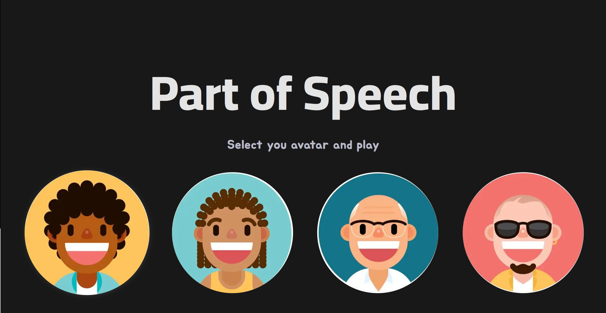
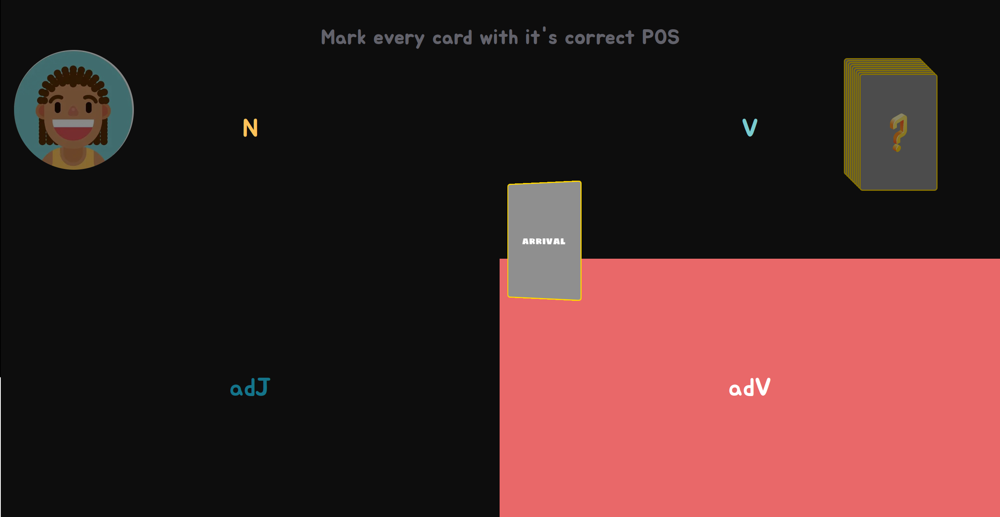
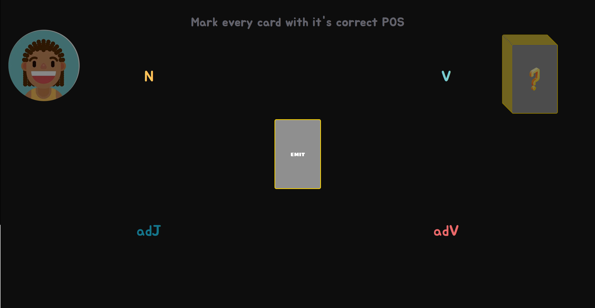
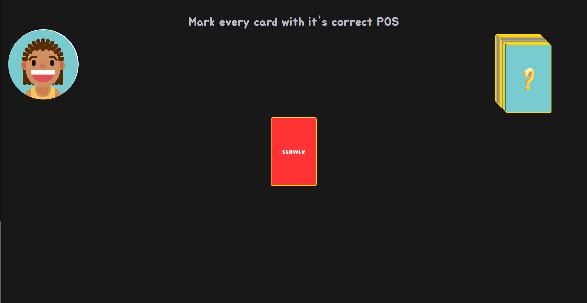
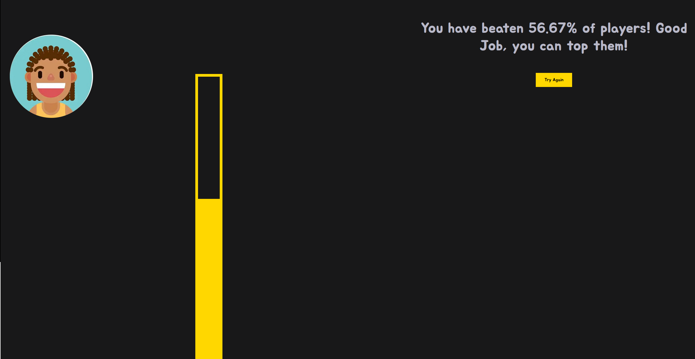

# Part of Speech Game
A learning activity/game that test your english part of speech (POS) knowledge, made with Node and Angular js.

## How to run it
The easiest way to run the game is just to follow the next steps:
- Make sure you have [docker & docker-compose]([https://](https://docs.docker.com/get-started/)) installed on your machine.
- Install the project and on it's root _where you will find docker-compose.yml_, run: `docker-compose build && docker-compose up`.
- Now you should find the game [here](http://localhost:4200).

__Note__: You can also run it through `yarn start` on _/server_ and `ng serve` on _/client_, and if everything is okey you can play from [here](http://localhost:4200).

## How to play it
- Choose your avatar
- Flip the cards
- Test your english
- See your rank
- And try it again

## Screenshots
#### Home Page

#### Playground

#### Choices

#### Wrong Choice

#### Rank

###### Author: Yusef Nsar
